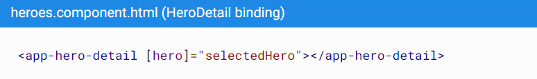

# Angular Learning

## Installation
- https://angular.tw/guide/setup-local
- https://code.visualstudio.com/

## 練習Angular官網上的英雄之旅範例

- https://angular.tw/tutorial


# 技術重點

## Angular 指令

+ ng new xxx (新建xxx angular專案)
+ ng serve --open (啟動開發伺服器、監聽原始檔並打開預設瀏覽器)
+ ng generate component xxx (生成xxx元件)
    - 這個命令會做這些事： 
      1. 建立目錄 src/app/hero-detail。 
      2. 在這個目錄中會產生四個檔案(css,html,ts,spec.ts) 
      3. 該命令還會把 HeroDetailComponent 新增到 src/app/app.module.ts 檔案中 @NgModule 的 declarations 列表中。
+ ng generate service xxx
    - 該命令會在 src/app/ 中產生 xxxService.ts ，類別內含@Injectable()，它把這個類別標記為依賴注入系統的參與者之一

## CH1
+ 雙向繫結

    當用戶輸入時，這個輸入框應該能同時顯示和修改英雄的 name 屬性。 也就是說，資料流從元件類別流出到螢幕，並且從螢幕流回到元件類別。
    要想讓這種資料流動自動化，就要在元素和元件屬性之間建立雙向資料繫結。<br>
    如: `<input id="name" [(ngModel)]="hero.name"></font>`

## CH2
+ *ngFor
    
    *ngFor 是一個 Angular 的複寫器（repeater）指令。 它會為列表中的每項資料複寫它的宿主元素。<br>
    如： `<li *ngFor="let hero of heroes">`

    `<li>` 就是 *ngFor 的宿主元素。
    heroes 就是來自 HeroesComponent 類別的列表。當依次遍歷這個列表時，hero 會為每個迭代儲存當前的英雄物件。<br><br>

+ *ngIf
    可根據條件包含或排除了一段 HTML
    如：<br><br>
    ```html 
    <div *ngIf="selectedHero">
    <h2>{{selectedHero.name | uppercase}} Details</h2>
    ```
    當 selectedHero 為 undefined 時，ngIf 從 DOM 中移除了英雄詳情。因此也就不用關心 selectedHero 的綁定了。當用戶選擇一個英雄時，selectedHero 也就有了值，並且 ngIf 把英雄的詳情放回到 DOM 中。<br><br>

+ click 事件繫結

    如：`<li *ngFor="let hero of heroes" (click)="onSelect(hero)">`<br><br>
    click 外面的圓括號會讓 Angular 監聽這個 `<li>` 元素的 click 事件。 當用戶點選 `<li>` 時，Angular 就會執行表示式 onSelect(hero)。<br>
    `(註： onSelect()方法需在Component自行定義)` <br><br>

+ class 繫結

    Angular 的類別繫結可以有條件地新增和刪除 CSS 類別。只需將 `[class.some-css-class]="some-condition"` 新增到要設定樣式的元素即可。<br>
    如： `[class.selected]="hero === selectedHero"` <br><br>
    如果當前行的英雄和 selectedHero 相同，Angular 就會新增 CSS 類別 selected，否則就會移除它。

## CH3

+ @Input() & 單向繫結

    @Input() 允許父元件更新子元件中的資料，如：<br><br>
    
    
    P.S. 這是一種單向資料繫結。從 HeroesComponent 的 selectedHero 屬性繫結到目標元素的 hero 屬性，並對映到了 HeroDetailComponent 的 hero 屬性，當 selectedHero 改變時，屬性繫結會修改 HeroDetailComponent 的 hero 屬性。

## CH4

+ ngOnInit()
    
    讓建構函式保持簡單，只做最小化的初始化操作，比如把建構函式的引數賦值給屬性。 建構函式不應該做任何事。 它當然不應該呼叫某個函式來向遠端服務（比如真實的資料服務）發起 HTTP 請求。

    而是選擇在 ngOnInit 生命週期鉤子中呼叫需做的 function，之後 Angular 會在構造出 HeroesComponent 的實例之後的某個合適的時機呼叫 ngOnInit()。

+ Observable & of()

    應用要從遠端伺服器獲取資料，那大概率會是非同步操作。可使用Observable & of()實現，of() 會返回一個 Observable<>，Observable 是 RxJS 函式庫中的一個關鍵類別。<br>如:
    ```
        getHeroes(): Observable<Hero[]> {
            const heroes = of(HEROES);
            return heroes;
        }
    ```
    而在調用時則須用Observable.subscribe()執行非同步工作
    ```
    getHeroes(): void {
            this.heroService.getHeroes()
                .subscribe(heroes => this.heroes = heroes;
        }
    ```

## CH5 (用route重構)

+ 新增 AppRoutingModule

    在 Angular 中，最好在一個獨立的最上層模組中載入和配置路由器，它專注於路由功能，然後由根模組 AppModule 匯入它。<br>
    範例 Route.ts：
    ```
    import { NgModule } from '@angular/core';
    import { RouterModule, Routes } from '@angular/router';
    import { HeroesComponent } from './heroes/heroes.component';        

    const routes: Routes = [
    { path: 'heroes', component: HeroesComponent }
    ];

    @NgModule({
    imports: [RouterModule.forRoot(routes)],
    exports: [RouterModule]
    })
    export class AppRoutingModule { }
    ```
    典型的 Angular Route 具有兩個屬性：
    1. path: 用來匹配瀏覽器位址列中 URL 的字串。
    2. component: 導航到該路由時，路由器應該建立的元件。<br><br>
    
    這會告訴路由器把該 URL 與 path：'heroes' 匹配。 如果網址類似於 localhost:4200/heroes 就顯示 HeroesComponent。最後，若要使用route，需在元素html中使用 `<router-outlet></router-outlet>`。

+ 新增路由連結 (routerLink)

    新增一個 `<nav>` 元素，並在其中放一個連結 `<a>` 元素(或其他)，當點選它時，就會觸發一個到指定元素的導航。如：
    ```
    <nav>
        <a routerLink="/heroes">Heroes</a>
    </nav>
    ```
    routerLink 屬性的值為 "/heroes"，Route.ts會用它來匹配出指指定元素的路由。

+ 引數化連結

    可在Route.ts裡加入類似的path匹配 <br>
    如：`{ path: 'detail/:id', component: HeroDetailComponent }` <br>
    範例 html
    ```
    <a *ngFor="let hero of heroes"
        routerLink="/detail/{{hero.id}}">
        {{hero.name}}
    </a>
    ```
    這樣便能導向不同陣列元素，作相對應的事情。

+ 返回上一頁

    需 `import { Location } from '@angular/common';`<br>
    並定義如下 即可調用
    ```
    goBack(): void {
        this.location.back();
    }
    ```


    
